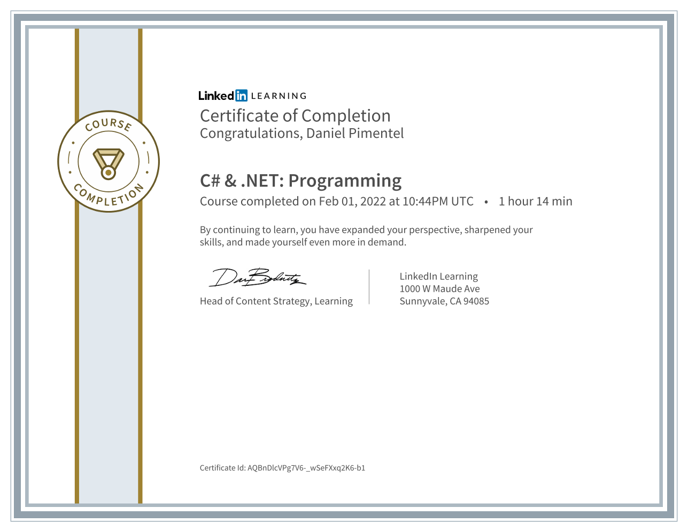

There are many features of .NET that can make your development workflow more productive and efficient. This training course helped me understand the essentials of .NET programming with C#—techniques that use .NET features to write richer, cleaner code. Alexander Zanfir explains how to use collections, make your app more responsive with async programming, assign and change class properties, optimize performance with multithreading, and inject data into strings. Plus, learn how to handle errors and manage application resources more efficiently with the using statement.

Certification:

