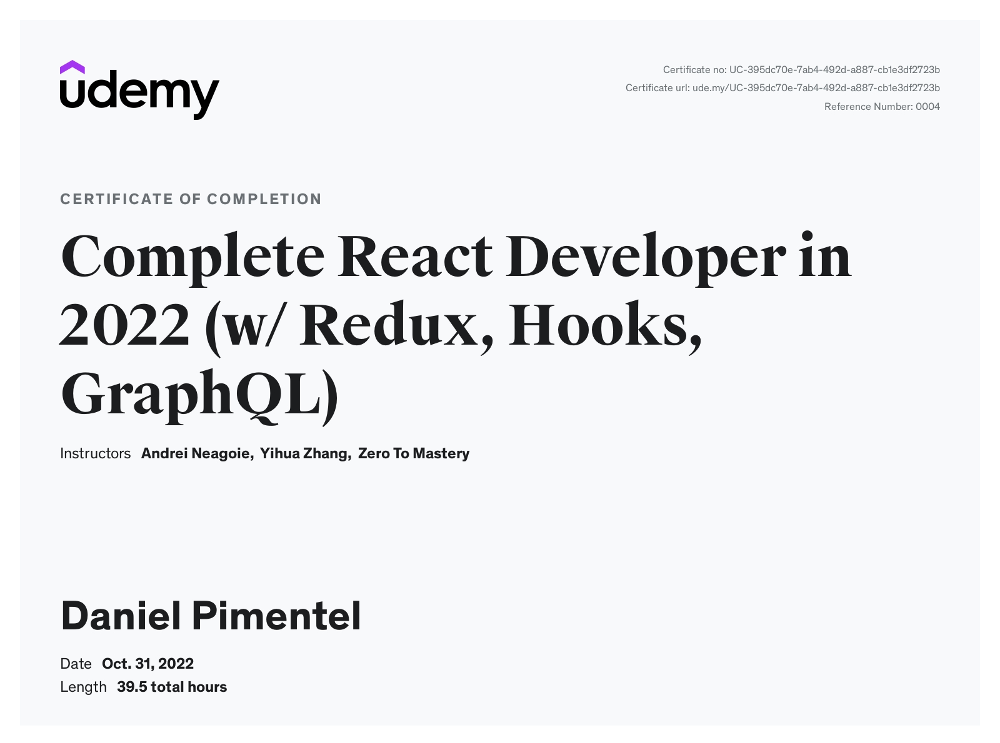

This project based course introduced me to all of the modern toolchain of a React developer in 2022. Along the way, I built a massive e-commerce application similar to Shopify using React, Redux, React Hooks, React Suspense, React Router, GraphQL, Context API, Firebase, Redux-Saga, Stripe + more.

The topics covered were:

- React Basics
- React Router
- Redux
- Redux Saga
- Asynchronous Redux
- React Hooks
- Context API
- React Suspense + React Lazy
- Firebase
- Stripe API
- Styled-Components
- GraphQL
- Apollo
- PWAs
- React Performance
- React Design Patterns
- Testing with Jest and Snapshot testing
- React Best Practices
- Persistance + Session Storage
- State Normalization

[E-Commerce App](https://crown-clothing-by-daniel.netlify.app/)

Certification:

